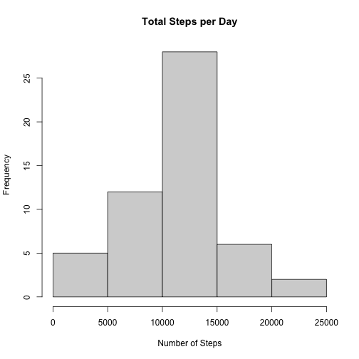
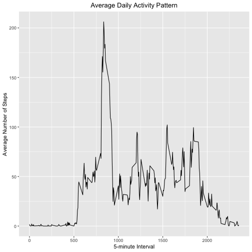
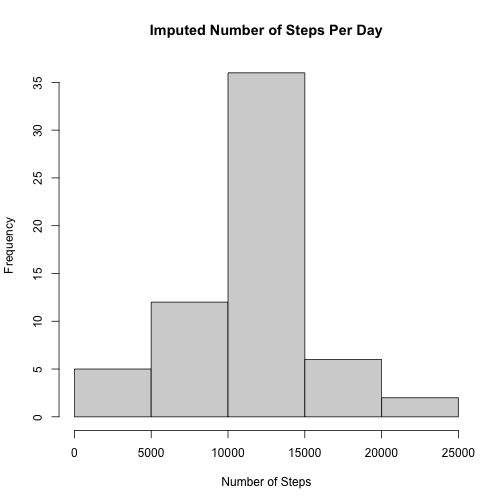
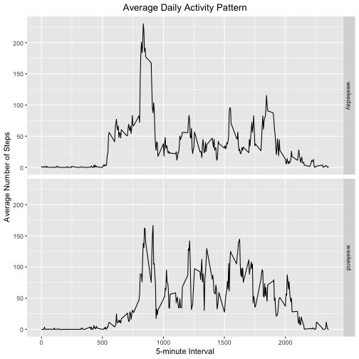

Before answering the questions, read in the data obtained from the course website and load packages


```r
activityData <- read.csv(file="activity.csv", header=TRUE)
library(ggplot2)
```


## What is the mean total number of steps taken per day?

Calculate the total steps taken per day, and create a histogram summarizing the results


```r
totalSteps <- aggregate(steps ~ date, activityData, FUN=sum)

hist(totalSteps$steps,
     main = "Total Steps per Day",
     xlab = "Number of Steps")
```



Then calculate the mean and median of the total steps taken


```r
meanSteps <- mean(totalSteps$steps, na.rm = TRUE)
medSteps <- median(totalSteps$steps, na.rm = TRUE)
```

The mean number of steps taken is 1.0766189 &times; 10<sup>4</sup>.
The median number of steps taken is 10765.

## What is the average daily activity pattern?

Create the time-series plot


```r
meanStepsByInt <- aggregate(steps ~ interval, activityData, mean)
ggplot(data = meanStepsByInt, aes(x = interval, y = steps)) +
  geom_line() +
  ggtitle("Average Daily Activity Pattern") +
  xlab("5-minute Interval") +
  ylab("Average Number of Steps") +
  theme(plot.title = element_text(hjust = 0.5))
```



Find the 5-minute interval that contains the maximum number of steps


```r
maxInt <- meanStepsByInt[which.max(meanStepsByInt$steps),]
```

## Inputing missing values

Calculate the total number of NAs in the dataset


```r
missingVals <- is.na(activityData$steps)
```

Replace the NAs with the 5-minute means of that interval, creating a new dataset


```r
imp_activityData <- transform(activityData,
                              steps = ifelse(is.na(activityData$steps),
                              meanStepsByInt$steps[match(activityData$interval,                               meanStepsByInt$interval)],
                              activityData$steps))

impStepsByInt <- aggregate(steps ~ date, imp_activityData, FUN=sum)
hist(impStepsByInt$steps,
     main = "Imputed Number of Steps Per Day",
     xlab = "Number of Steps")
```



Calculate the mean and median of the new dataset, as well as the differences between the 2 datatsets


```r
impMeanSteps <- mean(impStepsByInt$steps, na.rm = TRUE)
impMedSteps <- median(impStepsByInt$steps, na.rm = TRUE)
diffMean = impMeanSteps - meanSteps
diffMed = impMedSteps - medSteps
diffTotal = sum(impStepsByInt$steps) - sum(totalSteps$steps)
```

The mean of the new dataset is 1.0766189 &times; 10<sup>4</sup>. 
The median of the new dataset is 1.0766189 &times; 10<sup>4</sup>.  
The differences between the 2 datasets are as follows:  
1. Mean: 0  
2. Median: 1.1886792  
3. Total: 8.6129509 &times; 10<sup>4</sup> 

## Are there differences in activity patterns between weekdays and weekends?

Create 'weekend' and 'weekday' variables in the dataset


```r
DayType <- function(date) {
  day <- weekdays(date)
  if (day %in% c('Monday', 'Tuesday', 'Wednesday', 'Thursday', 'Friday'))
      return ("weekeday")
  else if (day %in% c('Saturday', 'Sunday'))
      return ("weekend")
  else
      stop ("Invalid Date Format.")
}
imp_activityData$date <- as.Date(imp_activityData$date)
imp_activityData$day <- sapply(imp_activityData$date, FUN = DayType)
```

Create a panel plot containing 2 time-series plots of the 5-minutes interval and the average number of steps taken for both weekend and weekday


```r
meanStepsByDay <- aggregate(steps ~ interval + day, imp_activityData, mean)
ggplot(data = meanStepsByDay, aes(x = interval, y = steps)) + 
  geom_line() +
  facet_grid(day ~ .) +
  ggtitle("Average Daily Activity Pattern") +
  xlab("5-minute Interval") +
  ylab("Average Number of Steps") +
  theme(plot.title = element_text(hjust = 0.5))
```




